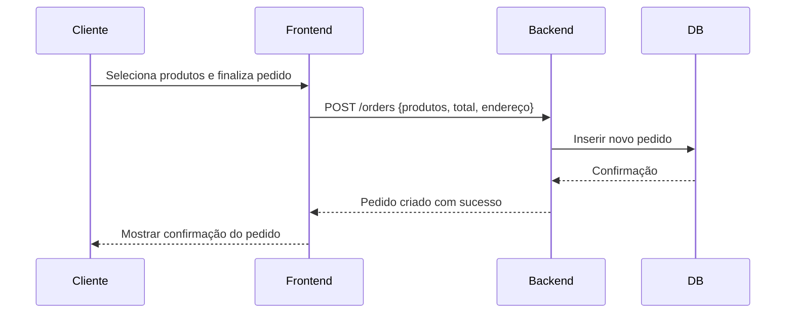
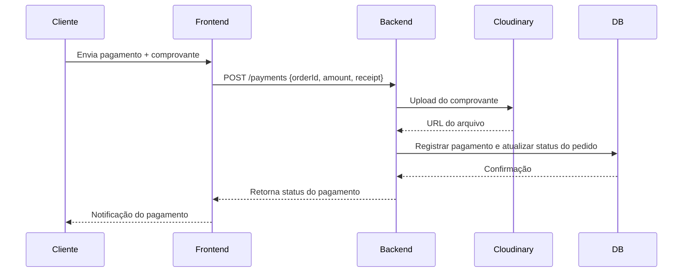
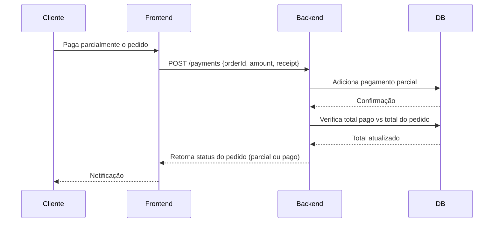
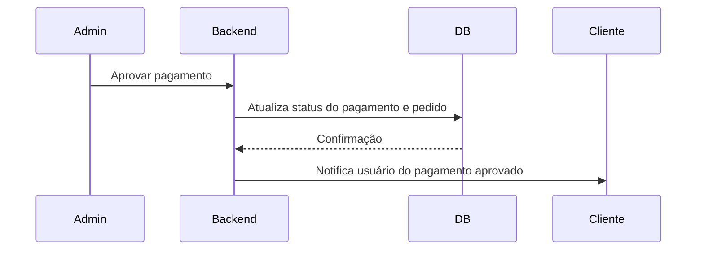
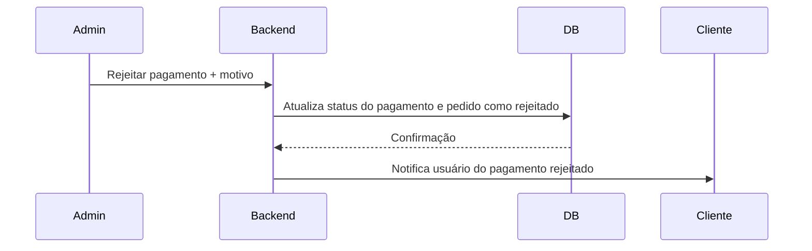
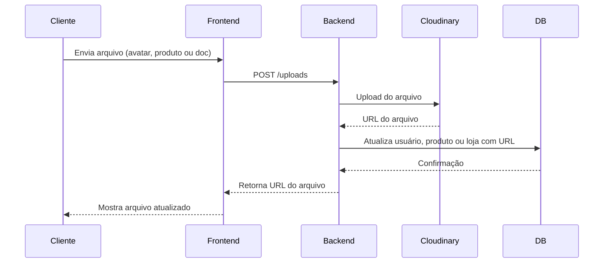

# Diagramas de Sequência - Bié Okutuala

## 1️⃣ Criação de Pedido

2️⃣ Pagamento com Comprovante


3️⃣ Pagamentos Múltiplos


4️⃣ Aprovação de Pagamento (Admin)


5️⃣ Rejeição de Pagamento (Admin)


6️⃣ Upload de Avatar/Imagens/Documentos


7️⃣ Reviews de Produtos

```mermaid
sequenceDiagram
    participant Cliente
    participant Frontend
    participant Backend
    participant DB
    Cliente->>Frontend: Envia review {rating, comment}
    Frontend->>Backend: POST /reviews
    Backend->>DB: Inserir review
    DB-->>Backend: Confirmação
    Backend-->>Frontend: Retorna review criado
    Frontend-->>Cliente: Mostra review
    Cliente->>Frontend: Solicita reviews do produto
    Frontend->>Backend: GET /reviews/product/:id
    Backend->>DB: Buscar reviews do produto
    DB-->>Backend: Lista de reviews
    Backend-->>Frontend: Retorna lista de reviews
    Frontend-->>Cliente: Exibe reviews

